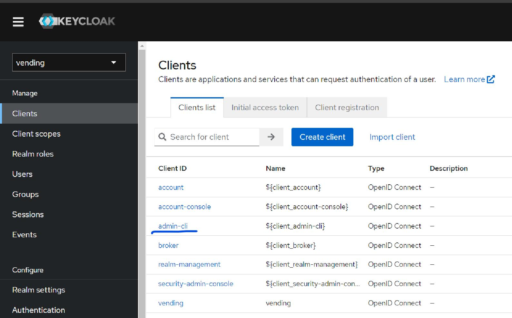
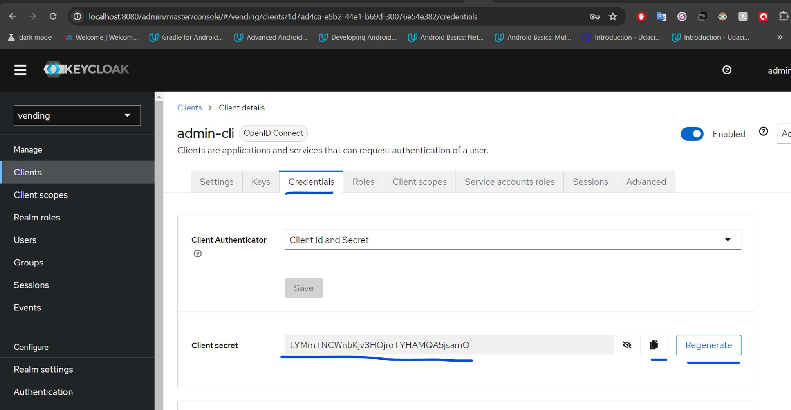

=  Vending Machine API
:doctype: book
:idprefix:
:idseparator: -
:toc: left
:toclevels: 4
:tabsize: 4
:numbered:
:sectanchors:
:sectnums:
:hide-uri-scheme:
:docinfo: shared,private
:attribute-missing: warn

[[admin]]
==  Run Keycloak Img:
- First go to doc folder
- then open cmd from this path
- run the 3 commands blow to make DB and keycloak containers
-
[source,bash]
----
docker network create -d bridge MyBridgeNetwork

docker run --name postgres_container --network=MyBridgeNetwork --env=POSTGRES_DB=vending --env=POSTGRES_PASSWORD=docker --env=POSTGRES_USER=docker -p 5432:5432 -d postgres

docker run --name keycloak_container --network=MyBridgeNetwork -p 8080:8080 --env-file ./env.txt -v "%cd%/import":/opt/keycloak/data/import quay.io/keycloak/keycloak:21.1.1 start-dev --import-realm

----
== Generate Secret key for Keycloak admin-cli
- go to http://localhost:8080/admin/master/console/#/vending/clients
- then chose admin-cli

- Then go to credentials tab - regenerate then copy the secret key to application.yaml in property "keycloak.credentials.secret"

== Postman Collection to use API:
[source,API]
----
In "./doc/postman collection" folder also you will find postman collection import it and enjoy.
----
